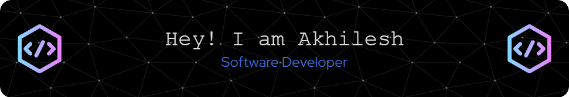

  
  <h3>Software Engineer | Full-Stack & Backend Engineer | AI/ML Engineer | Data & Cloud Architecture</h3>

  Passionate about designing and developing scalable, intelligent, and cloud-native software systems. I combine strong software engineering principles with artificial intelligence, data engineering, and emerging technologies to solve complex real-world problems.

---

### 🚀 About Me

- 🌱 Currently diving deep into **Generative AI, LLMs, RAG, and Quantum Computing**.
- 🔭 Actively working on **Enterprise SaaS Platforms, Full-Stack Applications, and AI-Powered Solutions**.
- 💬 Ask me about **Java, Spring Boot, React, System Design, Data Pipelines, and Cloud Architecture**.
- 📫 How to reach me: **akhiljadhav5151@gmail.com**
- 🌐 Portfolio: **akhileshjadhav.me**

---

### 🛠️ My Tech Stack

<h3>💻 Programming Languages</h3>

  
  
  
  
  
  

<h3>🌐 Frontend</h3>

  
  
  
  
  
  
  

<h3>⚙️ Backend & Frameworks</h3>

  
  
  
  
  
  

<h3>🤖 AI, Machine Learning & Data</h3>

  
  
  
  
  
  
  
  
  
  
  

<h3>🗄️ Databases</h3>

  
  
  
  
  
  
  

<h3>☁️ Cloud & DevOps</h3>

  
  
  
  
  
  
  
  

---

### 🌟 Featured Projects

| Project | Description | Technologies |
| :--- | :--- | :--- |
| **Vertex Portal** | SaaS-style live coding interview platform with secure authentication, 1-on-1 video interviews, real-time chat, code execution, analytics dashboard, and interview workflow management. | React, Node.js, Express, MongoDB, Stream SDK, Piston API, Inngest |
| **Quantum Image Encryption** | Research project implementing hybrid quantum image encryption using DNA encoding, chaotic permutation, CNOT gates, and fingerprinting with comprehensive security analysis. | Python, Qiskit, Streamlit, IBM Quantum, NumPy |
| **AR Visionary** | Enterprise restaurant management platform featuring orders, CRM, inventory, billing, subscriptions, analytics, and role-based access control. | Java, Spring Boot, React, Redux, MySQL, AWS S3 |
| **AdSnap Studio** | AI-powered ad generation platform supporting HD image generation, packshots, lifestyle shots, generative fill, and image editing using Bria AI APIs. | Python, Streamlit, Bria AI API, Pillow, NumPy |
| **Multithreaded HTTP Proxy Server** | High-performance Java HTTP proxy with LRU caching, sliding-window rate limiting, concurrent request processing, and real-time metrics. | Java, Socket Programming, Concurrency, ExecutorService |
| **FastMCP + LangGraph Demo** | Terminal-based MCP demo connecting a FastMCP server to a LangGraph ReAct agent with tool orchestration, web search, and multi-step reasoning. | Python, FastMCP, LangGraph, OpenAI API, Tavily |
| **NEAT Self-Driving Car Simulation** | Autonomous self-driving car simulation where neural networks evolve using NEAT to navigate a race track through reinforcement-free neuroevolution. | Python, NEAT-Python, Pygame CE |
| **AI Image Generator** | Web application that converts text prompts into AI-generated images using Hugging Face models with an intuitive user interface. | JavaScript, Hugging Face API |
---

### 🤝 Let's Connect

  
  &nbsp;
  
  &nbsp;
  
  &nbsp;
  

---

### 📊 My GitHub Stats

<!-- Fixed broken URLs by using the most reliable, actively maintained stat and streak generators -->

  
    
  
    
  
    
  

